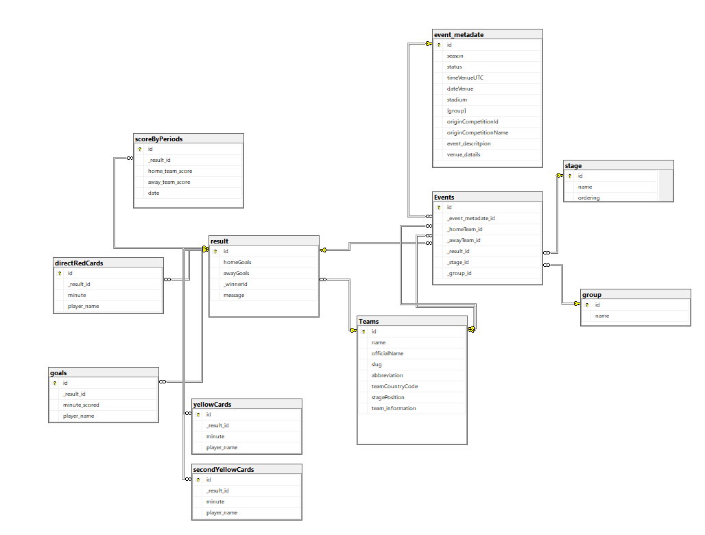

# Sport Radar - Football Calendar Application

A Spring Boot web application for managing football competitions, teams, matches, and tournament stages. This application provides a calendar view of matches and allows users to track tournament groups, stages, and match results.

## Quick Start (⭐ Recommended)

### Prerequisites
- **Docker**: Latest version installed
- **Docker Compose**: Latest version installed

### Run with Docker

```bash
git clone https://github.com/toniejatoty/sport-radar.git
cd sport-radar/football-calendar
docker-compose up --build
```

Done! 🎉 Access the application at **http://localhost:8080**

---

## Table of Contents
- [Sport Radar - Football Calendar Application](#sport-radar---football-calendar-application)
  - [Quick Start (⭐ Recommended)](#quick-start--recommended)
    - [Prerequisites](#prerequisites)
    - [Run with Docker](#run-with-docker)
  - [Table of Contents](#table-of-contents)
  - [Overview](#overview)
  - [Technology Stack](#technology-stack)
  - [Features](#features)
  - [Docker Setup](#docker-setup)
    - [Environment \& URLs](#environment--urls)
    - [Commands](#commands)
  - [API Endpoints](#api-endpoints)
    - [Match Calendar](#match-calendar)
    - [Teams](#teams)
    - [Groups](#groups)
    - [Stages](#stages)
    - [Results](#results)
  - [Assumptions and Design Decisions](#assumptions-and-design-decisions)
    - [1. **Database Design**](#1-database-design)
    - [2. **Docker Architecture**](#2-docker-architecture)
    - [3. **UI/UX Decisions**](#3-uiux-decisions)
    - [4. **Tournament Model**](#4-tournament-model)
  - [Database Schema](#database-schema)
  - [License](#license)

## Overview

The Sport Radar Football Calendar application is designed to manage international football tournaments. It allows administrators to:
- Add and manage teams
- Create tournament groups and stages
- Record match events (home team, away team, stage, group, result)
- View a comprehensive calendar of all tournament matches
- Track upcoming and completed matches

The application uses a web-based interface built with Spring MVC and Thymeleaf templates, with data persisted in a SQL Server database.

## Technology Stack

- **Backend Framework**: Spring Boot 4.0.5
- **Java Version**: Java 21 (in Docker), Java 17+ (for local development)
- **ORM**: Spring Data JPA (Hibernate)
- **Template Engine**: Thymeleaf
- **Database**: Microsoft SQL Server 2022
- **Build Tool**: Maven 3.9.9
- **Containerization**: Docker & Docker Compose
- **JSON Processing**: Jackson Databind 2.18.1

## Features

- ✅ Add and manage football teams with official names and abbreviations
- ✅ Create and manage tournament groups (e.g., Group A, Group B)
- ✅ Define tournament stages (e.g., ROUND OF 16, SEMI-FINALS)
- ✅ Record match events with home/away teams, stage, and group
- ✅ Track match results (goals scored by home and away teams)
- ✅ Display upcoming and completed matches in a calendar view

- ✅ Fully containerized with Docker

## Docker Setup

### Environment & URLs

**With Docker Compose (recommended):**
- Application: `http://localhost:8080`
- SQL Server: `localhost:1433`
- Database User: `sa`
- Database Password: `TwojeHaslo123!`

### Commands

Start the application:
```bash
docker-compose up --build
```

Stop the application:
```bash
docker-compose down
```


## API Endpoints

### Match Calendar
- `GET /events` - View all matches
- `GET /events/add` - Show form to add new match
- `POST /events/save` - Save a new match

### Teams
- `GET /teams` - View all teams
- `GET /teams/add` - Show form to add new team
- `POST /teams/save` - Save a new team

### Groups
- `GET /groups` - View all tournament groups
- `GET /groups/add` - Show form to add new group
- `POST /groups/save` - Save a new group

### Stages
- `GET /stage` - View all tournament stages
- `GET /stage/add` - Show form to add new stage
- `POST /stage/save` - Save a new stage

### Results
- `GET /results` - View all match results
- `GET /result/add` - Show form to add new result
- `POST /results/save` - Save a new result

## Assumptions and Design Decisions

### 1. **Database Design**
   - Normalized schema with separate tables for Teams, Groups, Stages, Events, and Results
   - Events (matches) reference Teams, Groups, and Stages as foreign keys
   - Matches are optional (can be added without results)
   - Results are optional (matches can be marked as "Upcoming")

### 2. **Docker Architecture**
   - Multi-stage Docker build: compilation happens in Maven container, runtime uses JRE-only image for smaller size
   - Docker Compose orchestrates both SQL Server and Spring Boot application
   - SQL Server runs in a container for easy setup (no local installation needed)
   - Default password is configured in docker-compose.yml for development

### 3. **UI/UX Decisions**
   - All user interface text is in English for international accessibility
   - Thymeleaf templates provide server-side rendering for better SEO and performance
   - Simple HTML tables for data display (no JavaScript frameworks required)
   - Forms use POST method for data mutations, following REST conventions


### 4. **Tournament Model**
   - Tournaments can have multiple **Stages** (e.g., Group Stage, Knockout)
   - Stages can have multiple **Groups** (e.g., Group A, Group B)
   - **Teams** participate in specific Groups within Stages
   - **Matches** (Events) connect two Teams with an optional Result


## Database Schema



The database schema includes the following tables:
- **Teams**: Stores team information (name, official name, slug, abbreviation, country code)
- **Groups**: Tournament groups (Group A, Group B, etc.)
- **Stages**: Tournament stages (Group Stage, ROUND OF 16, etc.)
- **Events**: Matches connecting home team, away team, stage, and group
- **Results**: Match results (goals scored)
- **Event_Metadata**: Additional event information
- **Goals**: Information minute and player name has scored the goal
- **Yellow Cards**: Information minute and player name has received a yellow card
- **direct Red Card**: Information minute and player name has received a red card
- **Second Yellow Card**: Information minute and player name has received a second yellow card
- **Score By Periods**: Information of score in tearms of periods
- 

## License

This project is licensed under the MIT License. See the [LICENSE](LICENSE) file for details.

---

**Author**: Konrad Wołkiewicz  
**Last Updated**: March 2026


